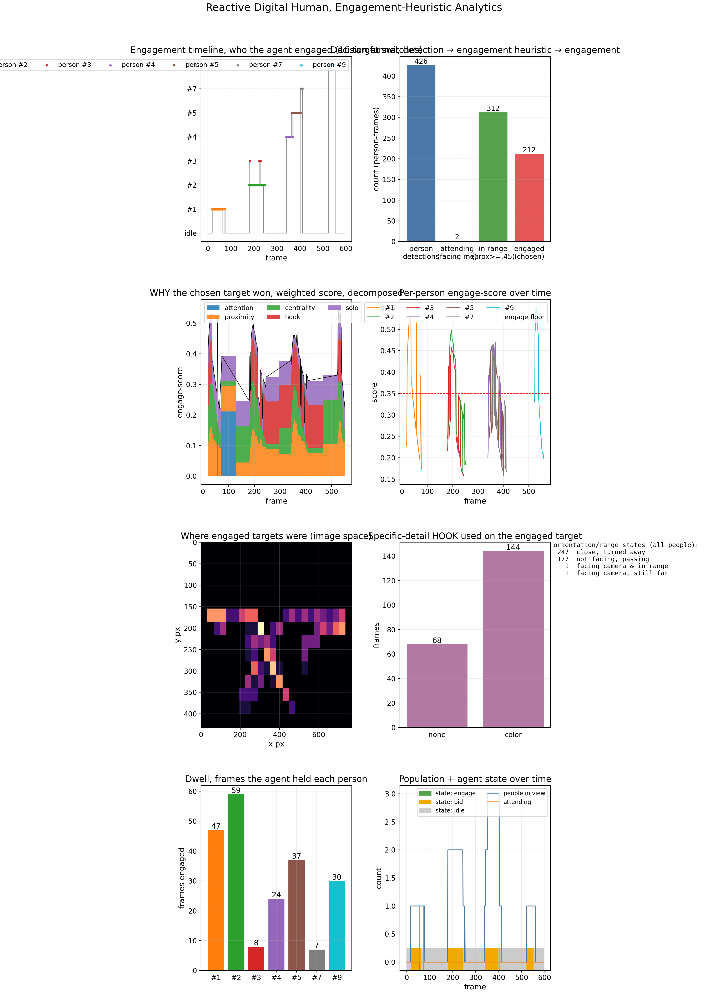

<!-- REDACTION NOTE (internal, Thread F): media/ still contains hero shots of identifiable, non-consenting
people (hero_corridor, hero_faces, hero_gaze, hero_speaking, hero_engage_3people, hero_openvocab). Do NOT
share this page externally until those are redacted (face-blur alone is insufficient; gait/clothing/location
re-identify too). Charts/dashboards (no people) are fine. This comment is not rendered on the page. -->

# Looking Alive — An Interactive, Perceptive Leonardo da Vinci

*A character that doesn't just talk **at** you. It **notices** you, and it has the restraint to know when not to.*

---

## The idea in one breath

Walk up to most digital characters and they run a script. Walk up to **this** one and the first thing it does is read the room: who is actually present with it, who has turned toward it and lingered, who is just passing through. Then it does the harder, more human thing, it **chooses**, often choosing to wait. When it does engage, it opens on the **shared craft**, the thing Leonardo actually cared about, never on how you look. And because every one of those judgments is a logged number, including every choice to hold back, it can show you exactly why it engaged *this* person and not the one beside them.

The bet behind the project:

> **Engagement feels alive when it is *earned and intentional*, not when it is constant. A character that notices genuine signals, engages with restraint, and can prove why, reads as present rather than as a greeter.**

The persona is **Leonardo da Vinci** on purpose. He was history's greatest *observer*, he filled notebooks with how light falls, how the eye reads a face, how birds hold the air. So the character's superpower (noticing, and being selective about it) and his identity are the same thing. When Leonardo opens on how a painted gaze seems to follow you across a room, it isn't a line about you; it is a genuine question from someone who worked at that problem for years. Every word he says is grounded in the historical record.

This is built for **public space**, a queue, an exhibit, a lobby, a plaza, where a character that engages the right person at the right moment, and leaves everyone else alone, is the difference between presence and a nuisance. (A themed-character deployment is one possible demo, not the framing.)

---

## What I'm trying to accomplish

A character that, in real time and in a public space:

1. **Perceives** the people around it, who is there, where they are looking, whether they have lingered.
2. **Decides with restraint** *who* to engage, *when*, and, crucially, *when to hold back*, so engagement is intentional, not indiscriminate.
3. **Reacts believably and in character**, curious, warm, self-deprecating, and grounded in the real Leonardo.
4. **Can justify every choice it makes**, including the choices *not* to engage, so the behaviour is trustworthy, tunable, and auditable.

The north star is **earned, intentional engagement**: the character that notices the right moment, respects everyone else, and can show its reasoning.

---

## The arc — three phases

| Phase | What it is | Status |
|---|---|---|
| **1 · Master's — Virtual Interactive Da Vinci** | An on-screen Leonardo that perceives people through a camera, decides who/when to engage *and when to hold back*, reacts in a grounded persona, and logs every decision. | **In progress — the perception + restraint decision engine + the authored persona run today; a live integration runner chains them end to end** |
| **2 · Projected Da Vinci** | The same brain projected into physical space: a life-size Leonardo that plays to a **crowd**, aims attention at the right individual, and can highlight exhibits with light. | Designed; next build |
| **3 · Robotic Da Vinci (PhD)** | The believable character transferred to a **physical robot**, reactive, expressive embodiment with real motion and sim-to-real transfer. | Research roadmap |

Each phase keeps the same beating heart, *perceive, decide with restraint, react believably, and stay auditable*, and changes the body it lives in: screen, projection, robot.

---

## What's running today (Phase 1)

The hard part of "alive" isn't the face, it is the **judgment**: out of everyone in view, who is genuinely open to a moment, and is *now* the right time, or is the honest answer to wait? That engine is built and runs in real time on a single consumer GPU (an earlier perception build measured ~25-30 FPS in small scenes; end-to-end throughput of the integrated runner will be measured in the webcam session, and latency scales with crowd size). Here is what it actually does.

### It decides who to engage — and when to hold back

The character reads each person (are they oriented toward it, have they come close, have they lingered) and commits to **at most one**, only when a genuine relevance signal *and* a social-license signal are both present, otherwise it waits. This restraint is the point: an indiscriminate "greet everyone" baseline is exactly what this is **built to be measured against** (that measured run is pending consented or synthetic footage).

### Every decision, including every restraint, is on the record

Because a character staged in public has to be *trustworthy and tunable*, the system logs every choice and can **re-derive it from the log**, who it engaged, who it deliberately passed over, and which signals drove each call. The audit trail is the real differentiator: nothing is a black box, and "why not her?" has an answer.



### What it says is grounded in the real Leonardo — and it is about the craft, never about you

When the character engages, it speaks from a set of **authored, fact-checked lines** drawn from Leonardo's own notebooks and the historical record (Vasari, the Anonimo Gaddiano, Isaacson, and his *Treatise on Painting*). Each line is about the shared fascination, how a gaze seems to follow you across a room, why he left so much unfinished, never a remark about a person's appearance or body. The justification for engaging lives in the log; what he *says* is just genuine, in-character curiosity.

*(A short screen capture of an earlier build of the live system is in [`media/explainability.mp4`](./media/explainability.mp4); newer captures are being refreshed as the reframed system comes together.)*

---

## How it works (the short version)

```
   camera  ──►  perceive          ──►  decide WITH RESTRAINT           ──►  react (in character)
                • who & where           • is there a genuine signal?         • speak a fact-checked
                • are they looking?     • is engagement licensed now?          line about the craft
                • have they lingered?   • or is the honest call to WAIT?     • (justification stays
                                        └────────  every choice, including every restraint,  in the log)
                                                   is logged and re-derivable  ──────────────┘
```

The character treats a public space the way a considerate person does: read the room, engage the one person for whom it is genuinely the right moment, and leave everyone else in peace, on the record either way.

---

## The research behind it — the advisors I'm targeting

This project sits at the intersection of four researchers' work, and the PhD arc is built to bring their strengths together:

- **Markus Gross** *(ETH Zürich / Disney Research)* — interactive digital characters and the technology that makes them feel present, including projection into physical space.
- **Heni Ben Amor** *(Arizona State, Interactive Robotics Lab)* — reactive control and robot learning: characters and robots that respond to people in the moment. The engine behind Phase 3's embodiment.
- **Joseph Campbell** *(Purdue, CAMP Lab)* — theory of mind, anticipating human intent, and **interpretable** interaction, the science of a character that reasons about people *and can explain why it acts*. The backbone of the "justify every decision" principle.
- **Stelian Coros** *(ETH Zürich, Computational Robotics Lab)* — physics-based, expressive character and robot motion, how a believable performance transfers to a body that has to obey physics.

Together they map onto the arc: **Gross** (believable character + projection) → **Campbell** (perceive & reason about people, explainably) → **Ben Amor / Coros** (move that believability into a physical robot).

---

## Why this fits public-space and immersive experiences

A character in a shared space earns its keep by engaging the right person at the right moment and respecting everyone else, the opposite of a greeter that talks at whoever is nearest. This project builds that as a **real-time, restrained, explainable system**: it notices genuine signals, engages intentionally, speaks in a grounded persona about the shared craft, and can prove every call it made. Da Vinci is the first character; the earned-engagement engine is the reusable product.

---

## Roadmap

- **Now:** perception + the restrained "who/when, or wait" decision engine + full auditability + the authored, fact-checked persona, chained by a live integration runner (camera run pending a webcam session). Plus **the digital face**: a cartoon Leonardo grounded in his own self-portrait, animated deterministically from the logged decision, with a GAGAvatar 3D head standing up alongside it (see `building-the-face/`).
- **Next:** the measured selectivity result (the restraint policy vs an indiscriminate baseline, on consented or synthetic footage); a real TTS voice with Audio2Face lip-sync replacing the text-derived mouth timeline; the 3D orbit render; more of the persona's concept range (hands, light, flight).
- **Then (Phase 2):** the face on physical hardware — an articulated bust, gaze actuation, projection + crowd play + attention-to-the-right-person + exhibit highlighting.
- **PhD (Phase 3):** transfer to a physical, reactive robot.

*Honest status: the believability user study and the measured selectivity run are designed but not yet run; the face animates on screen but has no real voice yet (the mouth timeline is derived from text, not audio) and lives in no hardware; the persona is grounded in verified passages, not a deep reading of every full source.*

---

## About this folder

- **`media/`** — screenshots and captures. Charts and dashboards are current; the hero shots with identifiable people are being **redacted before any external sharing**.
- **`journal/`** — dated build-and-progress updates, added as meaningful milestones land.
- **`building-the-face/`** — the dev-story for the digital face: the narrative, the mechanism part by part, the making-of, the 3D upgrade, and the tuning pass, with the source figures in `images/`. Four reenactment figures are **withheld** here because their driver panel shows an identifiable real person and carries a third-party watermark; `THE-3D-UPGRADE.md` marks each spot inline. See `DEPOSIT-NOTE-2026-09-02.md` for the full provenance of this material.

*Living document — updated as the project grows.*
