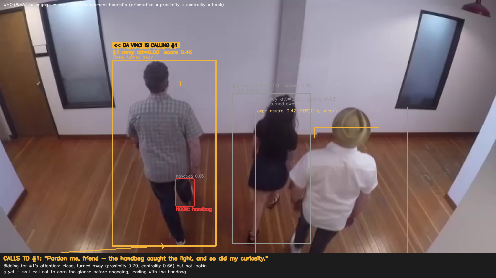
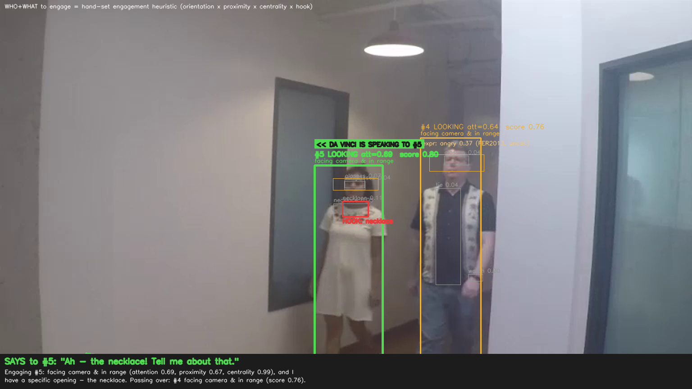
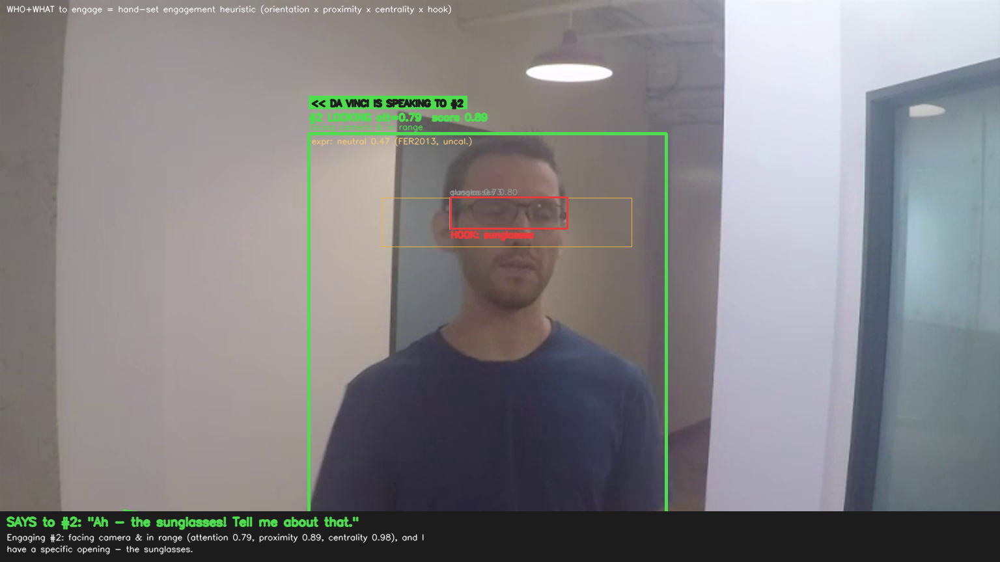
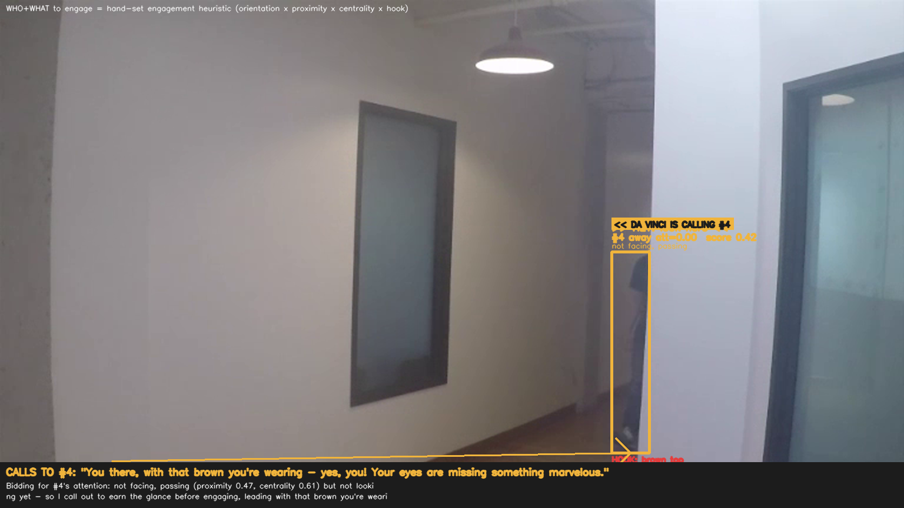

# Looking Alive — An Interactive, Perceptive Leonardo da Vinci

*A character that doesn't just talk **at** you — it **notices** you.*

---

## The idea in one breath

Walk up to most digital characters and they run a script. Walk up to **this** one and the first thing it does is *see you* — your red hat, the camera around your neck, a kid's toy lightsaber — and it opens on **that**, in character, the way only a great host would. The bet behind the whole project is simple and, I think, true:

> **Being noticed *specifically* — real perception, not generic friendliness — is what makes a character feel alive.**

The persona is **Leonardo da Vinci** on purpose. He was history's greatest *observer* — he filled notebooks with how light falls, how the eye reads depth, how faces move. So the character's superpower (noticing the world and the person in front of it) and his identity are the same thing. When Leonardo says *"that blue scarf — the eye reaches for colour before the mind names it,"* it isn't a gimmick; it's who he is.

This is built for the place that magic matters most: **guests in a real space** — a queue, an exhibit, a lobby — where a character that genuinely reacts to *this* person, right now, turns a wait into a moment.

---

## What I'm trying to accomplish

A character that, in real time and in a public space:

1. **Perceives** the people in front of it — who's there, where they're looking, what's distinctive about them.
2. **Decides, like a good host would,** *who* to engage, *what* to open with, and *when* to wait — including gently **earning a distracted guest's attention** before launching in.
3. **Reacts believably and in character** — warm, curious, a little mischievous.
4. **Can explain every choice it makes** — so designers can trust it, tune it, and stage it.

The north star is the **"it noticed *me*"** moment, produced reliably, on demand, for thousands of guests.

---

## The arc — three phases

| Phase | What it is | Status |
|---|---|---|
| **1 · Master's — Virtual Interactive Da Vinci** | An on-screen Leonardo that perceives guests through a camera, decides who/what/when to engage, and reacts believably — all in real time and fully explainable. | **In progress — the perception + decision engine is running today** |
| **2 · Projected Da Vinci** | The same brain projected into physical space: a life-size Leonardo that plays to a **crowd**, aims his gaze and attention at the right individual, and can highlight exhibits with light. | Designed; next build |
| **3 · Robotic Da Vinci (PhD)** | The believable character transferred to a **physical robot** — reactive, expressive embodiment with real motion and sim-to-real transfer. | Research roadmap |

Each phase keeps the same beating heart — *perceive → decide → react believably* — and changes the body it lives in: screen → projection → robot.

---

## What's running today (Phase 1)

The hard part of "alive" isn't the face — it's the **judgment**: out of everyone in view, who is open to a moment, and what do I say to *them*? That engine is built and runs at **~26 FPS on a single consumer GPU**. Here's what it actually does, in its own frames.

### It picks who to engage — and explains why

Three guests in a corridor. The character reads each one, scores how open they are, and commits to **one** — here, on a specific visible detail — while the panel spells out who it passed over and why. This is the "good host" judgment, made visible.



### It notices specific things — by name, open-vocabulary

It isn't limited to a fixed list of objects. It recognizes **the glasses, the tie, the scarf, a hat — even a toy lightsaber** — and opens on the most distinctive one. That's the raw material of *"it noticed me."*



### It knows when you're actually looking

It reads each guest's **gaze and head orientation** — a graded, directional sense of "are you looking at me, or past me?" — so it engages people who are present *with* it, not just present.



### If you're not looking — it earns your attention first

The most human touch: when a guest is close but distracted, the character doesn't barge in. It throws a **catchy, respectful, funny bid for attention** — *"You there, with that blue scarf — yes, you! Your eyes are missing something marvelous."* — and only fully engages once it's earned the glance.



### Every decision is on the record

Because a character staged for guests has to be *trustworthy and tunable*, the system logs and visualizes every choice it makes — who it engaged, for how long, and exactly which factors drove each decision. Nothing is a black box.


*(A short screen capture of the live system is in [`media/explainability.mp4`](./media/explainability.mp4).)*

---

## How it works (the short version)

```
   camera  ──►  perceive          ──►  decide (the "host" judgment)   ──►  react
                • who & where           • who is open to a moment?           • open on their
                • are they looking?     • what specific detail to            specific detail
                • distinctive items       open on?                          • or earn attention
                                        • engage / get-attention / wait        first
                                        └──────────  every step is explainable  ──────────┘
```

The character treats engagement the way a skilled performer treats a room: read everyone, choose the right person and the right opening, and don't waste a line on someone walking away.

---

## The research behind it — the advisors I'm targeting

This project sits at the intersection of four researchers' work, and the PhD arc is built to bring their strengths together:

- **Markus Gross** *(ETH Zürich / Disney Research)* — interactive digital characters and the technology that makes them feel present, including projection into physical space. The lineage closest to a believable, deployable character host.
- **Heni Ben Amor** *(Arizona State, Interactive Robotics Lab)* — reactive control and robot learning: characters and robots that respond to people in the moment. The engine behind Phase 3's embodiment.
- **Joseph Campbell** *(Purdue, CAMP Lab)* — theory of mind, anticipating human intent, and **interpretable** interaction — the science of a character that reasons about people *and can explain why it acts.* This is the backbone of the "explain every decision" principle.
- **Stelian Coros** *(ETH Zürich, Computational Robotics Lab)* — physics-based, expressive character and robot motion — how a believable performance transfers to a body that has to obey physics.

Together they map onto the arc: **Gross** (believable character + projection) → **Campbell** (perceive & reason about people, explainably) → **Ben Amor / Coros** (move that believability into a physical robot).

---

## Why this fits immersive guest experiences

The single most repeatable bit of theme-park magic is a character who makes a guest feel *seen*. Today that depends on a gifted human performer. This project builds it as a **real-time, repeatable, explainable system** — a character that notices the specific guest in front of it, reacts in persona, plays to a crowd, and (eventually) steps off the screen into the room. Da Vinci is the first host; the engine is the product.

---

## Roadmap

- **Now:** perception + the "who/what/when to engage" decision engine (running).
- **Next:** the expressive talking face; a richer in-character voice; the affect/engagement read that lets Leonardo sense how a guest is responding and adapt.
- **Then (Phase 2):** projection + crowd play + gaze-to-the-right-guest + exhibit highlighting.
- **PhD (Phase 3):** transfer to a physical, reactive robot.

---

## About this folder

- **`media/`** — screenshots and screen captures of the live system. New, useful captures get dropped here as the project progresses.
- **`journal/`** — dated build-and-progress updates, added as meaningful milestones land.

*Living document — updated as the project grows.*
