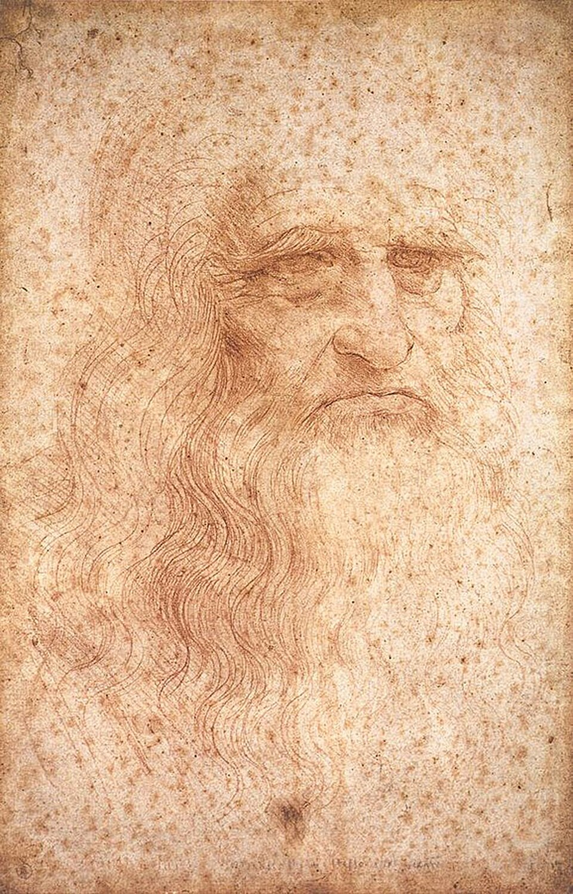
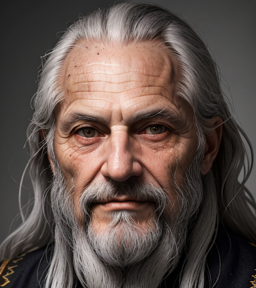
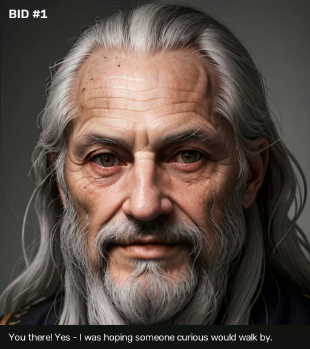
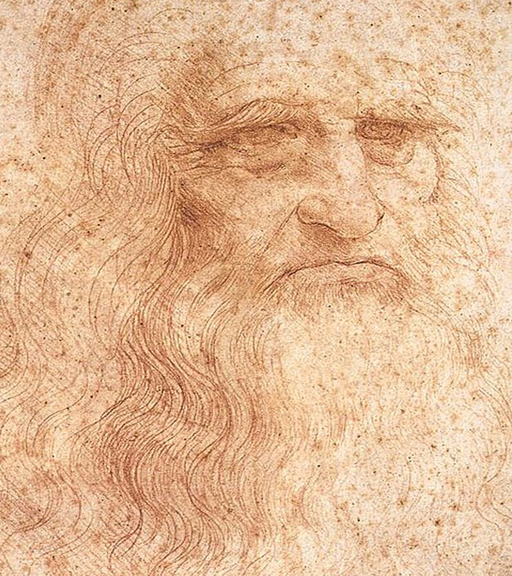
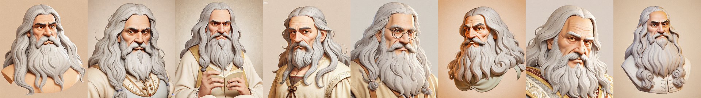
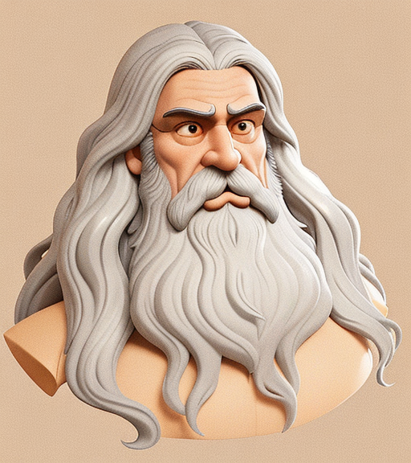
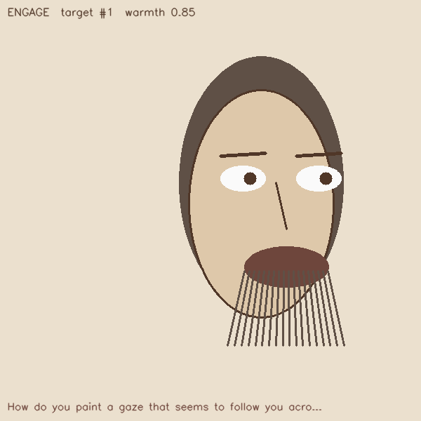
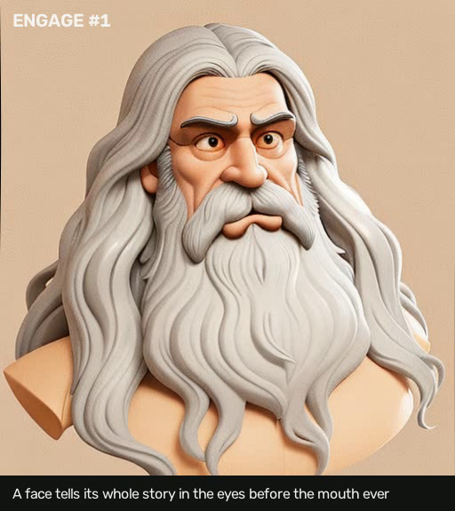

# Building da Vinci's Face

*A portfolio dev-story: how a reactive Leonardo da Vinci got a face that responds, and how that face became
his own. Evidence-led and honest, including the attempts that were replaced. Images in `./images/`.*

## The goal
The reactive da Vinci already decides, in real time, who to engage and what to say. The next step was to give
him a **face that responds**: turns toward the person he engages, warms its expression, and speaks the line,
all driven by the same logged decision so the animation stays faithful and auditable. And the identity had to
be **his own**, grounded in his self-portrait, not a stock avatar.

## The problem: you cannot animate the real self-portrait
His documented likeness is the red-chalk Turin self-portrait. It is a **three-quarter, chalk drawing**, and a
modern face detector cannot find or crop a face in it (no frontal, no photographic texture). Every automatic
face animator needs a detectable frontal face to work from. So the self-portrait, beautiful as it is, cannot
be animated directly.

## Attempt 1: a photoreal frontal (and why it was replaced)
The first solution generated a **frontal photoreal likeness** with Stable Diffusion (dreamshaper-8), prompted
from his documented features, and kept only the candidates a real face detector accepted. It animated well,
but the honest problem was identity: it read as a *generic photoreal old man*, not clearly Leonardo. Labeled
honestly in the code as *"a generated approximation, not a documented likeness."*

 

## The pivot: a cartoon grounded in the self-portrait
Two changes fixed the identity problem and suited the persona better: go **cartoon** (more character, less
uncanny), and ground it in the **actual self-portrait**.

Research first. For restyling a specific face while keeping its identity, the literature points to IP-Adapter
(a CLIP-embedding method that decouples identity from surface style) over InstantID (which entangles
appearance). IP-Adapter needed a large image-encoder download, so the pragmatic and *more literally grounded*
choice was **image-to-image directly from the self-portrait**: crop his head from the chalk drawing, feed it
as the base, and restyle to a cartoon with a prompt. Every candidate was passed through the MediaPipe face
detector so it stays animatable.

Ten seeds, all detector-accepted, one candidate even reading a book:

## The choice
The chosen look: a polished stylized 3D-cartoon character (img2img strength 0.70), recognizably from the
self-portrait, long wavy hair, very long beard, high forehead, heavy brow.

## How it animates (and why it stays faithful)
The animation is not neural video; it is a **landmark-driven warp**. MediaPipe detects 478 face landmarks on
the still, and the agent's decision stream moves the control points: brows lift, eyes widen, the mouth opens
to a lip-sync timeline, and the head turns (using per-landmark depth for a pseudo-3D turn), with a thin-plate
spline deforming the image per frame. Because every control is a deterministic function of the logged
decision, the same decision always produces the same animation, the by-construction audit extends to the
face. A crude CPU "control preview" (below) verifies the controls before the real render:

## The result
The chosen cartoon da Vinci, responding with the character's real authored, source-grounded lines, turned
toward the person he engaged, expression warmed, mouth animating, rendered natively on a single consumer GPU:

## How we did it (the stack)
1. **Identity:** Stable Diffusion (dreamshaper-8) image-to-image FROM the red-chalk self-portrait + a cartoon
   prompt, filtered to MediaPipe-detectable candidates.
2. **Face controls:** the logged engagement decision maps to a FaceState (ARKit blendshapes, gaze angle,
   mouth-open), deterministic and provenance-logged.
3. **Animation:** MediaPipe 478-landmark thin-plate-spline warp of the still, driven by that stream.
4. **Voice/lip-sync:** a deterministic text-driven mouth timeline now; real TTS + NVIDIA Audio2Face is the
   drop-in upgrade.
5. **Runs natively** on an RTX 3080 (torch + CUDA + MediaPipe), no cloud, no special OS setup.

## What I learned (and kept honest)
- **Iterate in public:** the photoreal attempt was a real step, kept and labeled, not hidden. The honest
  journey (photoreal-generic to self-portrait-grounded cartoon) is part of the story.
- **Constraints shape art:** "cartoonish" is bounded by "still face-detectable," the detector filter turned a
  vague style goal into a concrete, testable one.
- **Debugging counts:** the generator first hard-crashed with no error, a native OpenMP/DLL clash from
  importing MediaPipe and PyTorch in the wrong order. Fixing the import order fixed it. Small, real, the kind
  of thing that separates "it works on my machine" from "it works."
- **Honesty label:** the face is a *generated stylized approximation grounded in his self-portrait*, not a
  documented likeness. That label ships with it.

## Roadmap
Real TTS voice + Audio2Face lip-sync; then the higher-fidelity 3D upgrades (a FLAME head, or GAGAvatar for a
true orbitable photoreal head) when the payoff warrants the setup.
